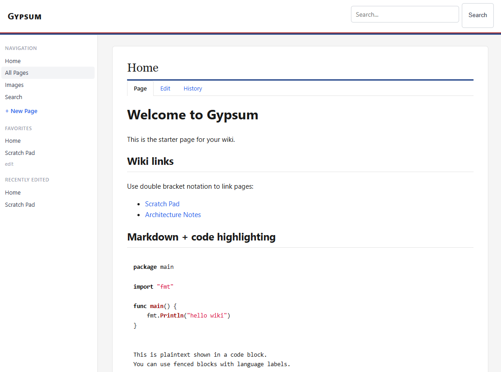

# Gypsum

A lightweight, self-hosted personal wiki built with Go. Pages are stored as plain Markdown files in a `data/` directory with automatic git versioning, wiki-style `[[links]]`, inline encrypted fields, image uploads, and a clean modern UI.



## Features

- **Markdown pages** — stored as `.md` files, rendered with [goldmark](https://github.com/yuin/goldmark) (GFM tables, syntax highlighting)
- **Wiki links** — `[[Page Title]]` creates inter-page links; clicking a link to a non-existent page opens the editor pre-populated with a `# Page Title` heading (preserving characters like `&` that are stripped from the URL slug)
- **H1 title override** — if a page starts with a level-1 heading (`# My Title`), that heading is used as the browser and page title instead of the slug-derived name; the heading is not rendered again in the body
- **Inline encryption** — `{{secure:secret}}` in the editor is AES-256-GCM encrypted on save; click the lock icon on a page to temporarily reveal the value (auto-hides after 60 seconds). Supports multiline blocks.
- **Content validation** — malformed or unknown custom tags are rejected on save with clear error messages
- **Page history** — view the git commit history for any page via the History tab; select two revisions and click **Compare Selected** to see a colorized unified diff between them
- **Image uploads** — paste from clipboard, drag-and-drop onto the editor, or click **Images** to browse and insert existing uploads. Filenames are derived from the original file name where available. Images auto-scale to fit the content width. Optional size hints: `` (px), `` (percent), `` (width×height)
- **Favorites sidebar** — edit `_favorites.md` to pin pages in the sidebar
- **Recent Edits** — paginated view of all wiki edits in reverse chronological order at `/recent-edits`, sourced from git history
- **Full-text search** — term-based search with relevance ranking; queries are split into words (punctuation stripped), each matched independently with prefix support (e.g. "lösen" finds "lösenord"); title matches rank higher than content matches
- **Auto git commits** — every page save and image upload is committed to a git repo inside `data/repo/`
- **Git remote sync** — optional push-after-commit and periodic pull with "ours wins" conflict resolution, configured via environment variables
- **Diff preview** — tick "Show diff" in the editor to review a colorized unified diff of the raw on-disk content before committing; the preference is remembered across sessions
- **Docker-ready** — single-container deployment with optional git remote sync
- **Dark/light theme** — toggle between dark and light mode via the button in the top bar; preference is remembered across sessions
- **Responsive layout** — mobile-friendly with a hamburger menu sidebar on small screens
- **Table editor** — click **Insert Table** (or **Edit Table** when the cursor is inside a table) to open a visual table editor modal; supports adding/removing rows and columns and per-column alignment (left/center/right)
- **Link graph** — interactive force-directed graph visualization at `/graph` showing how all wiki pages connect via `[[wiki links]]`; double-click a node to navigate to that page
- **MediaWiki import** — click "Import MediaWiki" in the editor to paste MediaWiki wikitext and convert it to Markdown automatically; handles headings, bold/italic, `<syntaxhighlight>`, `<nowiki>`, lists, tables, wiki links, and space-prefixed preformatted lines
- **MCP server** — built-in MCP (Model Context Protocol) endpoint at `/mcp` using Streamable HTTP transport; exposes the wiki as tools for AI assistants (list/read/create/edit/delete pages, search, image management, history, link analysis, MediaWiki import). Connect from Claude using a remote MCP custom connector
- **External MCP with OAuth** — optional `/mcp/external` endpoint protected by a built-in OAuth 2.0 Authorization Server (Authorization Code + PKCE, Dynamic Client Registration); enables secure internet-facing access from Claude without exposing the wiki UI. Encrypted `{{secure_aes:...}}` fields are redacted from all responses and pages with encrypted fields cannot be edited via this endpoint. Access tokens are persisted to disk so connections survive server restarts
- **Graceful shutdown** — handles SIGINT/SIGTERM, drains in-flight requests, and stops background goroutines cleanly
- **Rate limiting** — per-IP rate limiting on MCP and OAuth endpoints to prevent brute-force attacks
- **Header authentication** — optional reverse proxy auth via username/group headers (e.g. Authelia, Authentik); authenticated username is used as the git commit author
- **Health probes** — dedicated `/healthz` and `/readyz` endpoints on a separate port (default 9091) for Kubernetes probes, bypassing auth middleware
- **Access logging** — logs every request with method, path, status code, and duration
- **Editor help panel** — expandable markdown and syntax reference panel next to the editor
- **Unicode support** — page slugs support non-ASCII characters (e.g. `Lösenord`)

## Quick Start

### Prerequisites

- Go 1.23+ (for building from source)
- Git (for auto-commit functionality)

### Build and Run

```bash
# Clone the repository
git clone https://github.com/mnorrsken/gypsum.git
cd gypsum

# Build
make build

# Run (listens on :8080)
make run
```

Open [http://localhost:8080](http://localhost:8080) in your browser.

### Environment Variables

| Variable | Default | Description |
|---|---|---|
| `GYPSUM_SECRET_KEY` | `change-me-in-production` | Passphrase used to derive the AES-256-GCM encryption key for secure fields. **Set this in production.** |
| `GYPSUM_GIT_PULL_INTERVAL` | `5m` | How often to pull from the git remote (Go duration string, e.g. `2m`, `30s`). Only used when `GYPSUM_GIT_REMOTE_URL` is set. |
| `GYPSUM_OAUTH_ENABLED` | _(empty)_ | Set to `true` to enable the OAuth-protected `/mcp/external` endpoint. |
| `GYPSUM_OAUTH_PASSWORD` | _(required)_ | Single-user password for the OAuth login page. Required when `GYPSUM_OAUTH_ENABLED=true`. |
| `GYPSUM_EXTERNAL_URL` | _(required)_ | Public base URL with no trailing slash, e.g. `https://wiki.example.com`. Used to build OAuth discovery document URLs. Required when `GYPSUM_OAUTH_ENABLED=true`. |
| `GYPSUM_OAUTH_TOKEN_TTL` | `24h` | Access token lifetime as a Go duration string, e.g. `12h`, `7d`. |
| `GYPSUM_AUTH_USER_HEADER` | _(empty)_ | Set to a header name (e.g. `Remote-User`) to enable reverse proxy authentication. When set, every request (except OAuth endpoints) must include this header. The username is used as the git commit author. |
| `GYPSUM_AUTH_GROUP_HEADER` | `Remote-Group` | Header containing comma-separated group names. Only used when `GYPSUM_AUTH_USER_HEADER` is set. |
| `GYPSUM_AUTH_REQUIRED_GROUP` | _(empty)_ | If set, the group header must contain this group or the request is rejected with 403. |
| `GYPSUM_PROBE_PORT` | `:9091` | Listen address for the health-probe server (`/healthz`, `/readyz`). Set to a different `:<port>` to change. |

## Usage

### Pages

- All pages live in `data/repo/pages/` as `.md` files.
- Click **+ New Page** in the sidebar to create a page. You'll be prompted for a unique title.
- Use `[[Page Title]]` to link between pages. The title is converted to a slug (`Page_Title`) automatically.
- Each page has **Page**, **Edit**, and **History** tabs for quick navigation.

### Secure Fields

Store sensitive values inline in your markdown:

```
WiFi password: {{secure:my-secret-password}}
```

For multiline secrets, place `{{secure:` and `}}` on their own lines:

```
{{secure:
username: admin
password: s3cret
}}
```

On save, the `{{secure:...}}` block is encrypted with AES-256-GCM:

```
WiFi password: {{secure_aes:BASE64_CIPHERTEXT}}
```

When viewing the page, encrypted fields appear as `🔒****`. Click to decrypt and reveal the value for 60 seconds, then it auto-hides. A clipboard copy button appears next to revealed values. Multiline content renders with proper line breaks.

The editor validates custom tags on save — unknown tags, unclosed blocks, and improperly formatted multiline blocks are rejected with clear error messages.

### Page History

Click the **History** tab on any page to view its git commit log, showing revision hashes, dates, authors, and commit messages. Select two revisions using the **Old** and **New** radio buttons, then click **Compare Selected** to view a colorized unified diff between them.

### Images

There are three ways to upload and insert images into the editor:

- **Paste** — copy an image to the clipboard and paste it into the editor textarea.
- **Drag-and-drop** — drag an image file onto the editor textarea; a dashed border highlights the drop zone.
- **Image picker** — click the **Images** button in the editor toolbar to open a thumbnail gallery of all uploaded images. Click any image to insert it, or use "Upload new…" to upload directly from the picker.

In all cases a markdown image reference (``) is inserted at the cursor. The alt text and filename are derived from the original file name where available (e.g. `freddie-mercury-20260228-a1b2c3d4.jpg`); screenshots and browser-generated names fall back to a date-based name.

Images automatically scale down to fit the content area. You can also add an optional size hint to the alt text:

| Syntax | Effect |
|---|---|
| `` | max-width: 500px |
| `` | max-width: 50% |
| `` | width: 800px, height: 400px |

Manage images at `/images` (linked in the sidebar as **Images**). The index shows each image's thumbnail, filename, file size, and which pages reference it. Unused images can be deleted to free space.

Supported formats: PNG, JPG, JPEG, GIF, WEBP, SVG (max 10 MB).

### Diff Preview

Tick the "Show diff" checkbox in the editor before clicking Save. A colorized unified diff is displayed showing added lines (green) and removed lines (red) with surrounding context. The diff shows the raw on-disk content including `{{secure_aes:...}}` tags — encrypted fields whose plaintext hasn't changed keep stable ciphertext so they don't appear as noise. The checkbox preference is remembered across sessions via `localStorage`. Click **Confirm Save** to commit or **Back to Editor** to continue editing.

### Favorites

Edit the special `_favorites.md` page (linked at the bottom of the Favorites section in the sidebar) to pin pages:

```
[[Home]]
[[Scratch Pad]]
[[My Important Page]]
```

### Search

Use the search bar in the top navigation or visit `/search`. The query is split into individual terms (punctuation like `&` is stripped), each matched independently against page titles and content. Prefix matching is supported — e.g. searching "tokens & lösen" finds "Tokens & Lösenord". Results are ranked by relevance: title matches score higher than content matches, and pages matching all search terms are boosted.

## MCP Server

Gypsum has a built-in MCP (Model Context Protocol) endpoint using the Streamable HTTP transport. This lets AI assistants like Claude interact with your wiki remotely — no separate binary needed.

There are two endpoints:

| Endpoint | Auth | Secure fields | Use case |
|---|---|---|---|
| `/mcp` | None (rely on reverse proxy / Authelia) | Visible as ciphertext | Local / trusted network |
| `/mcp/external` | OAuth 2.0 (built-in, PKCE) | Redacted — shown as `[encrypted field]` | Internet-facing / Claude remote connector |

### Connecting from Claude (internal, trusted network)

In Claude's settings, add a **remote MCP server** (custom connector) pointing at your Gypsum instance:

```
URL: https://your-wiki.example.com/mcp
```

Protect this endpoint with your reverse proxy (e.g. Authelia, nginx auth) so it is not world-accessible.

### Connecting from Claude (internet-facing, OAuth)

Set the environment variables to enable OAuth (see table below), then add a remote MCP connector pointing at `/mcp/external`:

```
URL: https://your-wiki.example.com/mcp/external
```

Claude will detect the 401 response, follow the OAuth discovery documents, redirect you to the `/oauth/authorize` login page, and exchange the code for a Bearer token automatically. The token is valid for 24 hours by default.

**Authelia bypass rule** — add a bypass rule so Authelia does not intercept the OAuth and MCP paths:

```yaml
access_control:
  rules:
    - domain: your-wiki.example.com
      resources:
        - "^/mcp/external.*$"
        - "^/.well-known/oauth.*$"
        - "^/oauth/.*$"
      policy: bypass
    - domain: your-wiki.example.com
      policy: one_factor   # your normal rule for the wiki UI
```

The wiki UI at `/wiki/`, `/edit/`, etc. remains fully protected by Authelia.

### Claude Desktop (stdio proxy)

For local use or when the wiki isn't publicly accessible, use the `mcp-proxy` binary. It bridges stdio to the remote HTTP endpoint.

Build it with `make build`, then configure Claude Desktop (`%APPDATA%\Claude\claude_desktop_config.json`):

```json
{
  "mcpServers": {
    "gypsum": {
      "command": "C:\\path\\to\\mcp-proxy.exe",
      "args": ["https://wiki.example.com/mcp"]
    }
  }
}
```

### Available Tools

| Tool | Description |
|---|---|
| `list_pages` | List all wiki pages |
| `get_page` | Read a page's markdown content |
| `create_page` | Create a new page |
| `edit_page` | Update an existing page |
| `delete_page` | Delete a page |
| `search_pages` | Relevance-ranked search across pages (term-based, prefix matching) |
| `list_images` | List uploaded images with metadata |
| `delete_image` | Delete an image |
| `upload_image` | Upload a base64-encoded image |
| `get_recent_pages` | Recently modified pages |
| `get_favorites` | Favorite/pinned pages |
| `page_history` | Git revision history for a page |
| `get_page_revision` | Page content at a specific revision |
| `page_links` | Outgoing wiki links from a page |
| `what_links_here` | Pages that link to a given page (backlinks) |
| `link_graph` | Full wiki link graph (all pages and their links) |
| `create_page_from_mediawiki` | Create a page from MediaWiki wikitext (import only) |
| `edit_page_from_mediawiki` | Update a page from MediaWiki wikitext (import only) |

## Docker

### Build the Image

```bash
make docker-build
# or
docker build -t gypsum:latest .
```

### Run the Container

```bash
make docker-run
# or
docker run --rm -p 8080:8080 -v $(pwd)/data:/app/data gypsum:latest
```

Mount `/app/data` to persist pages and images across container restarts.

### Docker Environment Variables

All variables from the table above apply, plus these Docker-specific variables used by the entrypoint script:

| Variable | Default | Description |
|---|---|---|
| `GYPSUM_DATA_DIR` | `/app/data` | Path to the data directory inside the container |
| `GYPSUM_GIT_INIT` | _(empty)_ | Set to `true` to initialize a git repo in the data directory on startup |
| `GYPSUM_GIT_REMOTE_NAME` | `origin` | Name of the git remote |
| `GYPSUM_GIT_REMOTE_URL` | _(empty)_ | URL of a git remote to configure (e.g. for backup/sync) |
| `GYPSUM_GIT_USERNAME` | _(empty)_ | Git username for HTTPS authentication |
| `GYPSUM_GIT_PASSWORD` | _(empty)_ | Git password for HTTPS authentication |
| `GYPSUM_GIT_TOKEN` | _(empty)_ | Git token for HTTPS authentication (takes precedence over username/password) |
| `GYPSUM_GIT_COMMIT_NAME` | _(empty)_ | Git commit author name |
| `GYPSUM_GIT_COMMIT_EMAIL` | _(empty)_ | Git commit author email |
| `GYPSUM_GIT_PULL_INTERVAL` | `5m` | How often to pull from the git remote (e.g. `2m`, `30s`) |

### Docker Compose Example

A ready-to-use [`docker-compose.yaml`](docker-compose.yaml) is included in the repository:

```bash
docker compose up -d
```

Adjust environment variables in the file to set your encryption key and optional git remote sync.

## Helm Chart

Gypsum includes a Helm chart for deploying to Kubernetes.

### Install from OCI Registry

```bash
helm install gypsum oci://ghcr.io/mnorrsken/charts/gypsum
```

### Install from Source

```bash
helm install gypsum ./charts/gypsum
```

### Configuration

See all available values:

```bash
helm show values oci://ghcr.io/mnorrsken/charts/gypsum
```

Key values:

| Parameter | Default | Description |
|---|---|---|
| `image.repository` | `ghcr.io/mnorrsken/gypsum` | Container image repository |
| `image.tag` | `""` (uses `appVersion`) | Image tag override |
| `gypsum.secretKey` | `""` | AES-256-GCM encryption key. If empty, a pre-install hook generates one automatically |
| `gypsum.existingSecret` | `""` | Name of an existing Secret (must contain a `secret-key` key) |
| `persistence.enabled` | `true` | Enable persistent storage for wiki data |
| `persistence.size` | `1Gi` | PVC size |
| `persistence.existingClaim` | `""` | Use an existing PVC |
| `ingress.enabled` | `false` | Enable Ingress |
| `git.init` | `true` | Initialize a git repo in the data directory |
| `git.commitName` | `Gypsum` | Git commit author name |
| `git.commitEmail` | `gypsum@local` | Git commit author email |
| `git.remoteUrl` | `""` | Git remote URL for backup/sync |
| `git.pullInterval` | `5m` | How often to pull from the remote (Go duration, e.g. `5m`, `30s`). Only used when `remoteUrl` is set |
| `oauth.enabled` | `false` | Enable the OAuth-protected `/mcp/external` endpoint |
| `oauth.password` | `""` | Password for the OAuth login page. If empty, a pre-install hook generates one automatically |
| `oauth.externalUrl` | `""` | Public base URL with no trailing slash (e.g. `https://wiki.example.com`). Required when `oauth.enabled` is true |
| `oauth.tokenTtl` | `24h` | Access token lifetime (Go duration string, e.g. `24h`, `12h`) |
| `oauth.existingSecret` | `""` | Name of an existing Secret (must contain an `oauth-password` key) |
| `probePort` | `9091` | Port for the dedicated health-probe server (`/healthz`, `/readyz`). Kubernetes probes use this port to bypass auth middleware |

### Secret Handling

The encryption key (`GYPSUM_SECRET_KEY`) and the OAuth password (`GYPSUM_OAUTH_PASSWORD`) each follow the same pattern:

1. **Auto-generated (default)** — When no explicit value or existing secret is provided, a pre-install hook runs a Job that generates a random key and stores it in a Kubernetes Secret. The secret persists across upgrades.
2. **Explicit value** — Set `gypsum.secretKey` / `oauth.password` in your values.
3. **Existing secret** — Set `gypsum.existingSecret` / `oauth.existingSecret` to reference a Secret you manage externally (must contain a `secret-key` or `oauth-password` data key respectively).

> **Note:** When the OAuth password is auto-generated, retrieve it with:
> ```bash
> kubectl get secret <release>-gypsum-oauth -o jsonpath='{.data.oauth-password}' | base64 -d
> ```

### Example: Install with Ingress

```bash
helm install gypsum oci://ghcr.io/mnorrsken/charts/gypsum \
  --set ingress.enabled=true \
  --set ingress.hosts[0].host=wiki.example.com \
  --set ingress.hosts[0].paths[0].path=/ \
  --set ingress.hosts[0].paths[0].pathType=Prefix
```

## Data Directory Structure

```
data/
├── oauth_tokens.json   # OAuth token persistence (outside git repo)
└── repo/               # git working directory
    ├── .git/           # auto-initialized git repo
    ├── pages/          # markdown page files
    │   ├── Home.md
    │   ├── Scratch_Pad.md
    │   └── _favorites.md
    └── images/         # uploaded images
        └── my-photo-20260228-a1b2c3d4.png
```

## Development

```bash
make help       # show all targets
make fmt        # format Go source
make tidy       # tidy Go modules
make test       # run unit tests
make build      # build binary to ./bin/gypsum
make run        # run locally on :8080
```

## License

Apache License 2.0 — see [LICENSE](LICENSE).
